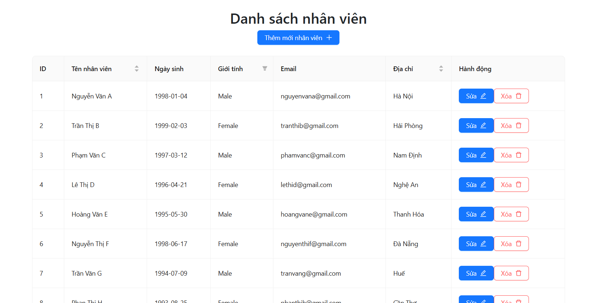
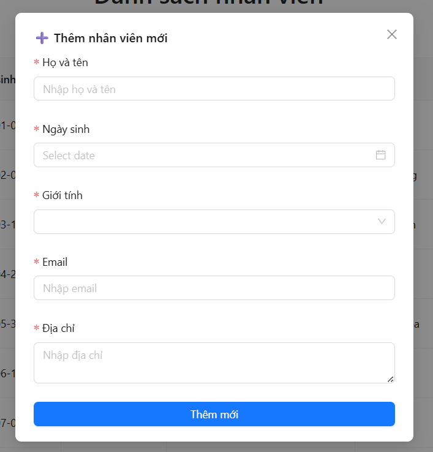
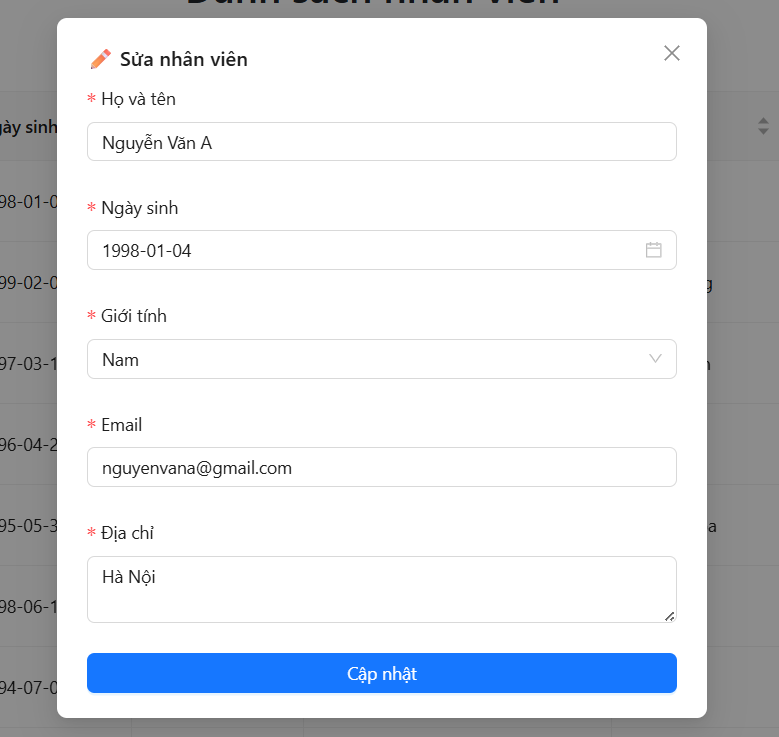
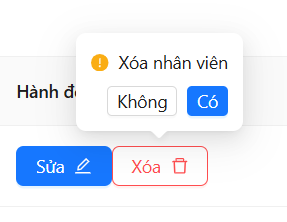

# TAO PAGE
## GIỚI THIỆU
## Đây là bài ứng tuyển "CRUD Employees" của CÔNG TY TNHH PHẦN MỀM VIETAPP 

## CÔNG NGHỆ SỬ DỤNG
- React + TypeScript + Vite
- React Query for data fetching & caching
- Axios for HTTP requests
- Ant Design for UI components
- React Hook Form for form management

## 🔹 1. Project Structure

📦src
 ┣ 📂pages
 ┃ ┣ ┣ Home.tsx
 ┃ ┃ ┣ List.tsx
 ┃ ┃ ┣ Signin.tsx
 ┃ ┃ ┣ Signup.tsx
 ┣ 📂utils
 ┃ ┣ 📂hook
 ┃ ┃ ┣ ModalCreatEdit.tsx (do số lượng file ít, nên em đã ko custom hook)
 ┃ ┣ ModalCreateEdit.tsx
 ┃ ┣ 📜_app.tsx
 ┃
  ┗ db.json

## 🔹 2. Cách chạy project
  - npm i
  - npm run dev + json-server --watch db.json --port 3000 

## 🔹 3. Image demo projects

[Đây là trang list](./src/img/list.png)
[Đây là trang list](./src/img/phantrang.png)
[Đây là trang add](./src/img/add.png)
[Đây là trang edit](./src/img/edit.png)
[Đây là trang xóa](./src/img/delete.png)

